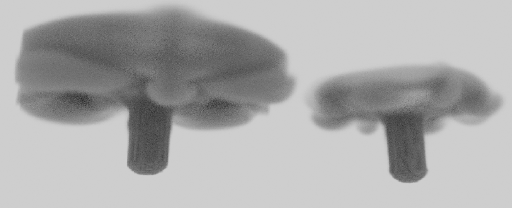

# Stable_Fluid
A simple cuda version for stable fluid implemention with various projection method. (Jacobi, Red Black Gauss-Siedel, Multigird(vcycle) etc.)


## How to run
The project had been tested on WSL2. Here is my HW/SW info:
- WIN11 Linux Subsystem -> Ubuntu22.04-LTS
- Graphics Card: RTX 4080
- nvcc version: 12.8.93
> Before building, you should checkout the `./CMakeLists.txt` file under the main project directory, where I force the path of `openVDB` here, you should remove the `list(...)` line if you are using package management tools like vcpkg etc.

Simply create the `build` directory, and do the normal cmake procedure.

```
cmake -B build
cmake --build build
cd build/src
```
You will see the executable file `main` or `main.exe`(windows). You can control the method of projection, how large the grid size and how many time steps per frame simply like below:

```
./main vcycle 128 16
```
This means choose `vcycle` method, the grid size is `128x128x128`, and `16` times iteration loop for each frame. The default setting is like below:

```
./main [method=='vcycle'] [grid_size=128] [times=16]
```
- method: `vcycle`, `rgbs`, `jacobi`
- grid_size: only `n x n x n` structured grid supported now
- times: `16` is preferred for the trade-off between visual effects and output file size

The output file is formatted as `.vdb` and `.vtk`. You can find it under the same directory as `main`. Since this project is only built for simulating not rendering, so you should using other DCC tools like `Houdini` or some nice renderers like `Mitsuba` to render the `.vdb` or `.vtk` results.